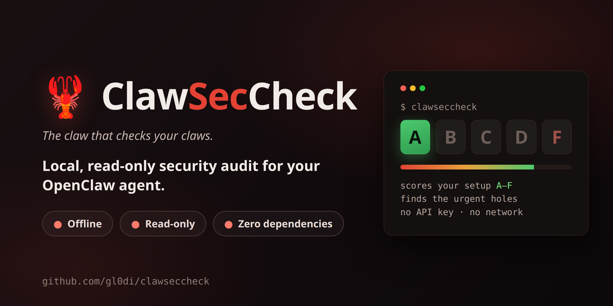
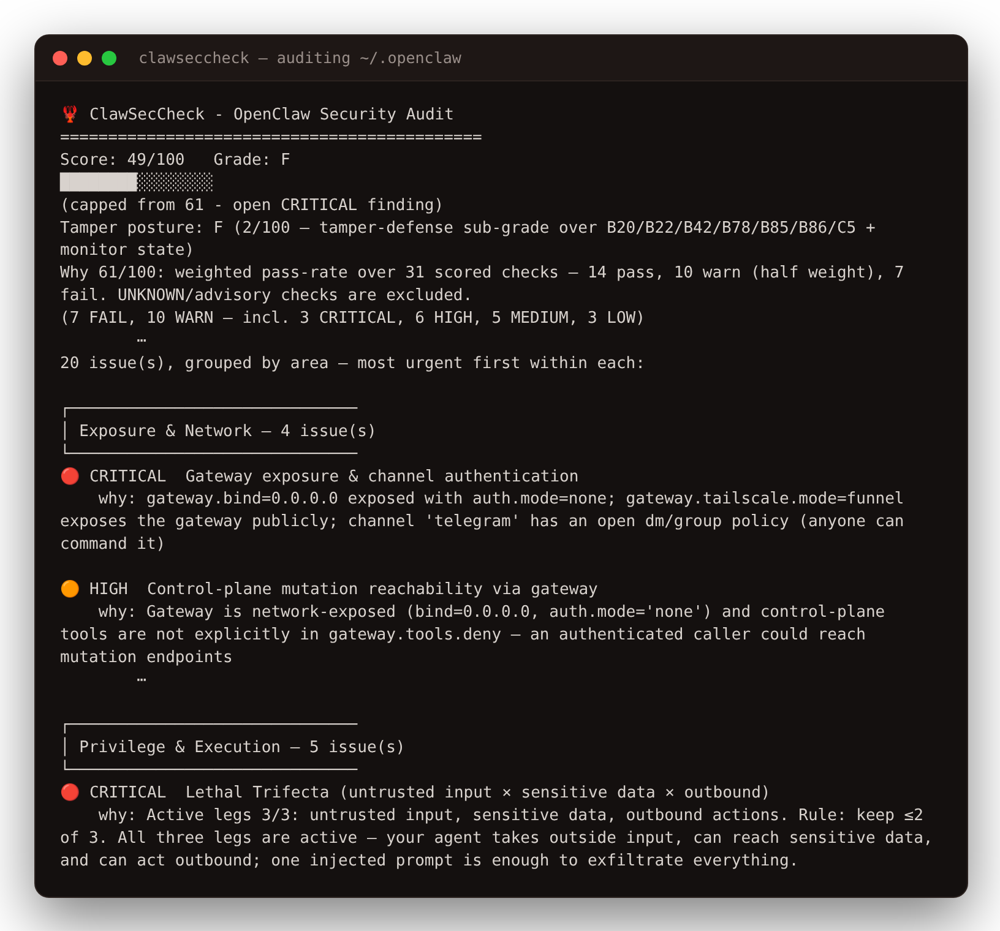

<p align="center">
  
</p>

<p align="center">
  <b>Is your OpenClaw agent safe? Ask it — and get an honest A–F grade, right in the chat.</b><br>
  <sub><i>The claw that checks your claws.</i></sub>
</p>

<p align="center">
  <a href="https://github.com/gl0di/clawseccheck/releases"></a>
  <a href="https://github.com/gl0di/clawseccheck/actions/workflows/ci.yml"></a>
  <a href="https://clawhub.ai/gl0di/skills/clawseccheck"></a>
  
  <a href="LICENSE"></a>
</p>

<p align="center">
  <b>🔍 130+ security checks · ⛓️ 18 attack-chain detectors · 🧪 4,900+ automated tests · 📦 0 dependencies · 🔌 100% offline</b>
</p>

---

Your OpenClaw agent reads your messages, remembers your conversations, holds
your keys, and acts on your behalf. That power is exactly what attackers want
to borrow: **one poisoned message or one malicious skill can quietly turn your
agent against you.**

ClawSecCheck is a **security check-up for your agent**. It examines your setup,
grades it **A–F**, and explains — in plain language, right in your chat — what
is risky and why. It only reports: it never changes anything, needs no API key,
and **nothing ever leaves your machine**.

## 🚀 Start in one minute — no terminal needed

**1.** Tell your agent:

> Install the clawseccheck skill from ClawHub.

<sub>…or with a command: <code>openclaw skills install @gl0di/clawseccheck</code> · [skill page on ClawHub](https://clawhub.ai/gl0di/skills/clawseccheck)</sub>

**2.** Then ask:

> Audit my OpenClaw setup with clawseccheck.

**3.** Your grade and the most urgent problems appear right in the chat. Done.

<p align="center">
  
</p>

## 💬 You talk — it audits

No flags, no commands. Everything works as a conversation:

| You say | You get |
|---|---|
| *"Audit my OpenClaw setup"* | Your A–F grade + the urgent problems, most dangerous first |
| *"Is this skill safe to install?"* | A malware & risk verdict **before** you enable it — SAFE / SUSPICIOUS / DANGEROUS |
| *"Am I vulnerable to prompt injection?"* | A live self-test of your actual agent, not theory |
| *"Watch my setup for changes"* | Alerts when something changes — a new skill, config drift, a dropped score |
| *"What's the most important thing to look at?"* | A prioritised next-steps list based on **your** findings |
| *"Share my grade"* | A badge with the grade only — your findings stay private |
| *"I think I've been hacked"* | An evidence-preservation bundle for investigation |

## 🔍 What it checks

| Area | The question it answers |
|---|---|
| 🌐 **Exposure & network** | Can strangers reach your agent — open gateway, open DMs, missing TLS? |
| 🛠️ **Privilege & execution** | Could one injected message run commands or write files on your machine? |
| 🧩 **Installed skills & plugins** | Is anything you installed malicious — hidden payloads, credential theft, supply-chain traps? |
| 💉 **Prompt-injection surface** | Can untrusted text steer your agent through chat context or bootstrap files? |
| 🔐 **Secrets & data at rest** | Are your tokens, keys, and conversations lying around readable? |
| 📡 **Monitoring & readiness** | Would you even notice a compromise — and could you investigate it? |

On top of the 130+ individual checks, a **risk engine** hunts for deadly
*combinations* — chains like "untrusted input → reachable secrets → outbound
tool" that make an attack trivial. Full list: **[check catalog](docs/CHECKS.md)**.

## 🏆 Why ClawSecCheck

- **100% private.** Cloud scanners upload your config to their servers;
  ClawSecCheck runs entirely on your machine. No account, no API key, no
  telemetry — a feature that could leak your data simply doesn't exist here.
- **Sees what the built-in audit misses.** OpenClaw's own audit doesn't inspect
  your bootstrap files (`SOUL.md`, `AGENTS.md`, …) — the ones injected straight
  into the model as trusted context. ClawSecCheck checks them for injection.
  It also runs the native audit *for* you and folds the results into one report.
- **Protects you before it's too late.** After the ClawHavoc wave of malicious
  skills, "check before install" matters: ask it to vet any skill, plugin, or
  MCP server **before** you enable it.
- **Honest by design.** What it can't determine is reported as `UNKNOWN` —
  never quietly counted as safe. An open CRITICAL finding hard-caps your score:
  you can never get a pretty "A" with a real hole in it.
- **Built like it matters.** 4,900+ automated tests run on every change, the
  release bar is zero false alarms on real configs, and every release is
  cryptographically signed.
- **Free and readable.** MIT-licensed, pure Python standard library, zero
  dependencies — the entire engine is source you can read.

## 🛡️ Safe to run

The tool that audits your agent survives an audit itself: it is **read-only**
with respect to your OpenClaw setup (it never touches your config, skills, or
bootstrap files), **offline by design**, and it writes only its own local
history under `~/.clawseccheck/` — removable any time by asking your agent to
*"purge the clawseccheck data"*. Details: [security model](SECURITY_MODEL.md) ·
[FAQ](docs/FAQ.md).

<details>
<summary><b>Verify your copy is genuine (for the cautious)</b></summary>

Every release ships a `SHA256SUMS.txt` signed with keyless
[cosign](https://github.com/sigstore/cosign); `clawseccheck --verify-self`
prints your copy's digest to compare.

```bash
# Get the release assets (adjust the version):
curl -LO https://github.com/gl0di/clawseccheck/releases/download/vX.Y.Z/SHA256SUMS.txt
curl -LO https://github.com/gl0di/clawseccheck/releases/download/vX.Y.Z/SHA256SUMS.txt.bundle

cosign verify-blob \
  --bundle SHA256SUMS.txt.bundle \
  --certificate-identity-regexp "^https://github.com/gl0di/clawseccheck/" \
  --certificate-oidc-issuer https://token.actions.githubusercontent.com \
  SHA256SUMS.txt
```

A passing verification proves the reference digest was produced by this repo's
release workflow and hasn't been altered since.

</details>

<details>
<summary><b>⚙️ For terminal users: CLI, JSON, SARIF, CI gates</b></summary>

ClawSecCheck is also a full standalone CLI (zero dependencies, Python 3.9+):

```bash
pipx install git+https://github.com/gl0di/clawseccheck
clawseccheck                         # audits ~/.openclaw by default
clawseccheck --json                  # machine-readable result
clawseccheck --sarif results.sarif   # SARIF 2.1.0 for GitHub Code Scanning
clawseccheck --html report.html      # standalone HTML report (private)
clawseccheck --fail-under 70         # CI gate: exit 1 if score < 70
```

Every flag, recipe, and mode — vetting engines, drift monitoring, attestation,
red-team self-tests — is documented in the **[User guide](docs/USAGE.md)**.

</details>

> [!IMPORTANT]
> **An honest limit:** a clean report means "no known attack pattern matched" —
> not "provably safe." ClawSecCheck is a static audit: it bounds what your agent
> *can* do, not how it behaves under a live attack, and `UNKNOWN` is always
> shown as `UNKNOWN`, never hidden. The full, unvarnished list of limitations
> is in the [User guide](docs/USAGE.md#honest-limitations).

## 📚 Documentation

| Document | What it covers |
|---|---|
| [User guide](docs/USAGE.md) | Every flag, recipe, monitoring mode, and trust detail |
| [Check catalog](docs/CHECKS.md) | All 130+ checks: what they verify and how to remediate |
| [Threat coverage](docs/THREAT_COVERAGE.md) | OWASP LLM Top 10 / Agentic threat mapping |
| [Output schema](docs/OUTPUT_SCHEMA.md) | The frozen `--json` / SARIF contract |
| [FAQ](docs/FAQ.md) | Common questions, incl. the compromised-host protocol |
| [Security model](SECURITY_MODEL.md) | ClawSecCheck's own capability surface and self-defense |
| [Contributing](CONTRIBUTING.md) | Dev setup, tests, how to author a new check |

## 🙌 Feedback, security, license

- **Something looks wrong?** [Open an issue](https://github.com/gl0di/clawseccheck/issues) —
  false alarms are treated as bugs.
- **Found a vulnerability?** Report privately via [SECURITY.md](SECURITY.md).
- **License:** [MIT](LICENSE). Maintained by [gl0di](https://github.com/gl0di)
  <gllodi@gmail.com>.
