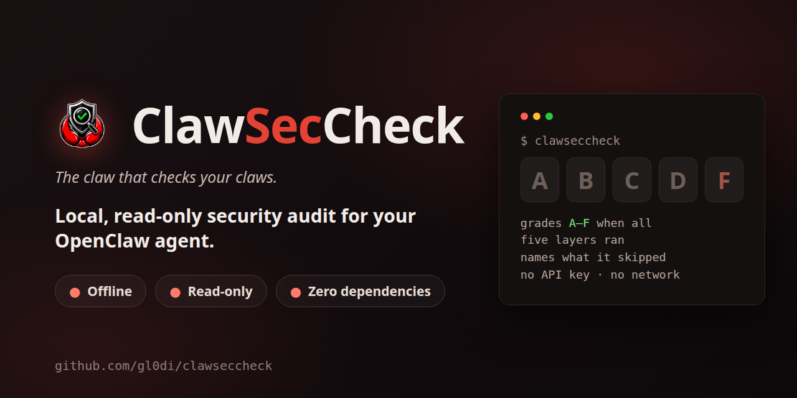
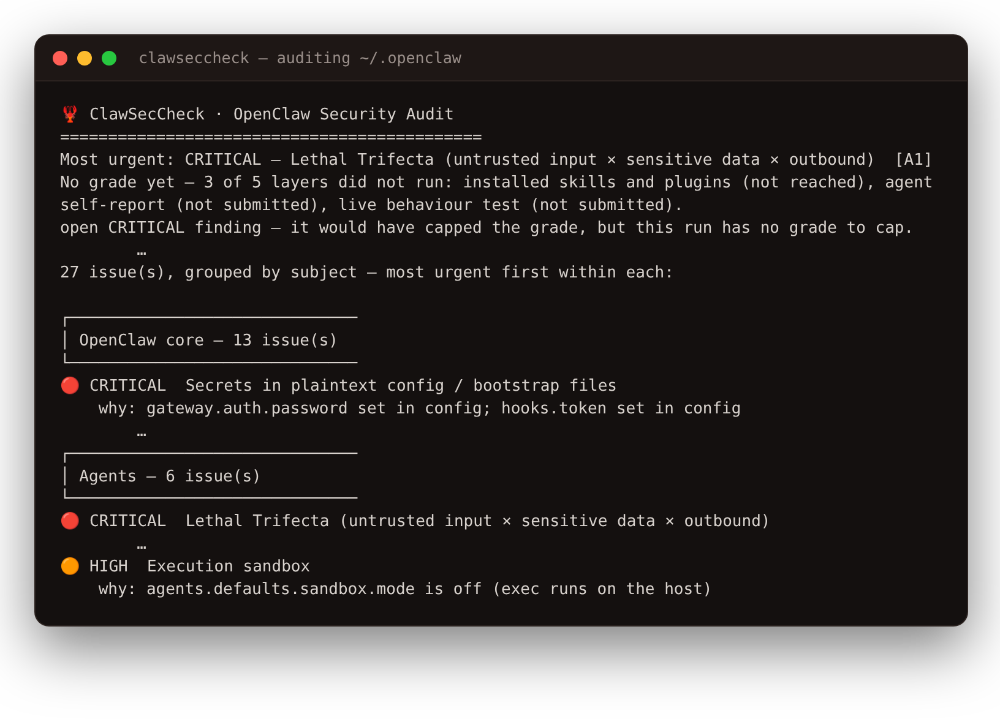
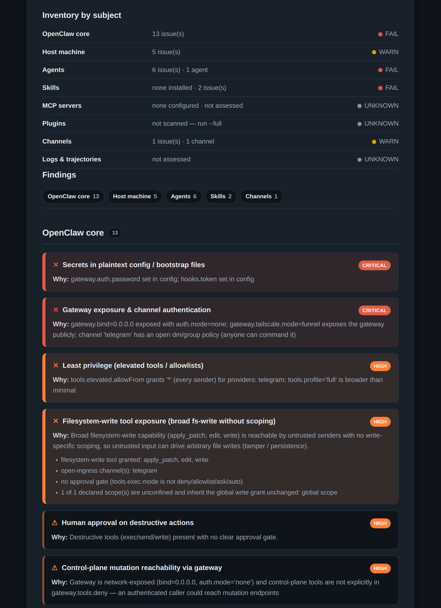

<p align="center">
  
</p>

<p align="center">
  <b>Is your OpenClaw agent safe? Ask it — you get a straight answer in words, right in the chat, and an honest A–F grade once all five audit layers have run.</b><br>
  <sub><i>The claw that checks your claws.</i></sub>
</p>

<p align="center">
  <a href="https://github.com/gl0di/clawseccheck/releases"></a>
  <a href="https://github.com/gl0di/clawseccheck/actions/workflows/ci.yml"></a>
  <a href="https://clawhub.ai/gl0di/skills/clawseccheck"></a>
  
  <a href="LICENSE"></a>
</p>

<p align="center">
  <picture>
    <source media="(prefers-color-scheme: dark)" srcset="docs/assets/stats-dark.svg">
    
  </picture>
</p>

<p align="center">
  <sub>Verified against <b>OpenClaw 2026.9.2</b> on <b>Linux</b> · also reads the pre-2026.8.1 config shapes · Python 3.9+ · <a href="#-compatibility">details</a></sub>
</p>

---

Your OpenClaw agent reads your messages, remembers your conversations, holds
your keys, and acts on your behalf. That power is exactly what attackers want
to borrow: **one poisoned message or one malicious skill can quietly turn your
agent against you.**

ClawSecCheck is a **security check-up for your agent — one you run again, not
once.** A setup is not safe or unsafe forever: you add a skill, connect an MCP
server, edit a config, and the answer changes. So it runs in three modes — a
deliberate full check, an ongoing **watch** that tells you what changed since
last time, and a before-you-install gate — and explains, in plain language,
right in your chat, what is risky and why. A full check earns an **A–F grade**,
but only once all five of its audit layers have run; short of that it leads with
the most urgent finding in words and names what didn't run, never a guessed
number. It reports, it doesn't
remediate: it never touches your OpenClaw config, needs no API key, and the
scanner itself makes **no network calls** — no telemetry, no uploads, ever.
(Two narrow, opt-in exceptions write inside the audited home — its own
suppression file, and a no-path `--pdf` into OpenClaw's managed attachment
directory. Neither is your config; see [Safe to run](#-safe-to-run) below.)

## 🚀 Start in one minute — no terminal needed

**1.** Tell your agent:

> Install the clawseccheck skill from ClawHub.

<sub>…or with a command: <code>openclaw skills install @gl0di/clawseccheck</code> · [skill page on ClawHub](https://clawhub.ai/gl0di/skills/clawseccheck)</sub>

**2.** Then ask:

> Audit my OpenClaw setup with clawseccheck.

**3.** The most urgent problems appear right in the chat, with an A–F grade if
that run covered all five audit layers — and a plain-language note on what it
didn't get to if it didn't. Done.

*What you'll see — a real default run against the deliberately vulnerable test setup bundled
with the repo. A default run reaches 2 of the 5 layers, so it names the most urgent finding
in words and says which layers it skipped, rather than printing a grade it hasn't earned:*

<p align="center">
  
</p>

<details>
<summary>See a longer excerpt of the same report</summary>

<p align="center">
  
</p>

</details>

## 💬 You talk — it audits

No flags, no commands. Everything works as a conversation, across three modes —
pick one by what you're actually asking:

### A · Full check — *how safe is this setup?*

Run it once, deliberately. Gives you findings — and a grade only when all five
audit layers behind it ran (see [Five layers, one grade](#-five-layers-one-grade) below).

| You say | You get |
|---|---|
| *"Audit my OpenClaw setup"* | A chat-sized card — findings, an inventory by subject, and the urgent problems most dangerous first, with an A–F grade when the run covered all five layers — plus a **PDF companion** carrying the rest: every installed skill/plugin/MCP server vetted, the riskiest capability chains, a behavioral replay, and a second opinion on any borderline call |
| *"Am I vulnerable to prompt injection?"* | An optional canary self-test you run against your own agent, alongside the static audit |
| *"What's the most important thing to look at?"* | A prioritised next-steps list based on **your** findings |
| *"Share my grade"* | A badge with the grade — only if one was issued; your findings stay private |
| *"I think I've been hacked"* | An evidence-preservation bundle for investigation |

### B · Watch — *what changed since last time?*

Run it repeatedly. Gives you events, never a number.

| You say | You get |
|---|---|
| *"Watch my setup for changes"* | Alerts when something changes — a new skill, config drift, a finding that appeared or cleared |
| *"What changed since the last check?"* | The same, on demand — the diff since the last recorded baseline |

**How the watch actually behaves.** The first run records a local baseline and
says so; it does not invent a "before" it never saw. Every later run compares
against it and reports only the difference:

```text
Baseline saved. Future runs will alert on what changes since now.
Baseline reference: a6a061e78c6239b7
```

```text
1 change(s) detected since last check:
⛔ NEW MCP server connected since last check: 'newthing' — vet it before
   trusting (new tool/data trust surface).
```

Three things make this a watch rather than a re-run:

- **It reports the change, not the state.** A run with nothing new says `No new
  threats among what was compared` — you are not asked to re-read a full report
  to spot what moved.
- **It says what it could not compare.** Once a baseline exists, every run ends
  with a count of dimensions it had no basis to diff (`ℹ️ 5 things could not be
  compared this run`), so a quiet run is never mistaken for a clean one. (The
  very first run has nothing to compare against yet and says *that* instead —
  the block above is what it prints.)
- **The baseline has a reference fingerprint.** Each run prints a short value;
  keep a copy off the machine and re-check it later with `--verify-baseline`.
  It moves whenever anything the watch recorded is different — so a copy you
  hold elsewhere is how you notice a local record that was quietly rewritten.
  It also moves when you change the flags you run with, and the check prints
  what it covered so you can tell those two apart.

Ask your agent to watch on a schedule, or run it yourself:

```bash
clawseccheck --monitor
```

Nothing leaves the machine: the baseline, the event journal and the score
history all live under `~/.clawseccheck/` and are removable at any time
(`--purge`). Points elsewhere with `--state` / `--events` if you want to keep
several watches apart.

### C · Before you install — *is this thing safe to add?*

Run it on the event. Gives you INSTALL / CAUTION / DO-NOT-INSTALL — not a
letter grade.

| You say | You get |
|---|---|
| *"Is this skill safe to install?"* | A pre-install risk verdict with the reasons — flags **suspicious** and **dangerous** skills before you enable them |

Everything else — verifying its own integrity, purging its local data, and
every flag below — works the same way regardless of which mode you're in.

## 🧬 Five layers, one grade

A full check (Mode A) is built from five layers, and they cost three different
things. Two run on a bare command (1 and 3). One needs a flag (2, `--full`).
The last two cannot run from a flag at all — one needs your agent to answer and
the other pokes your running agent live, so each closes only when its **answer**
is submitted back:

| # | Layer | Runs on its own? | How you get it |
|---|---|---|---|
| 1 | Static: config, files, permissions | yes — the default run | (default) |
| 2 | Sweep of what's installed: skills + plugins | no | `--full` |
| 3 | Logs and trajectories: what already happened | yes, budget-bounded | (default) — given up by `--full --fast` |
| 4 | Agent self-report | **no** — the agent has to answer | `--ask` → fill it in → `--attest <file>` |
| 5 | Live behaviour test | **no** — pokes the running agent | run `--canary` / `--dryrun` / `--redteam` / `--multiturn`, have your agent judge the result, then feed the verdict back with `--judged-bundle <file>` |

**A grade is issued only when all five ran.** Short of that there is no number
at all — you get findings, led by the most urgent one in words, plus a line
naming which layers didn't run. Concretely: a bare run leaves 3 of 5 untouched
(the installed sweep, the self-report, the live test); `--full` closes one of
those — the installed sweep — and leaves 2 of 5 (self-report, live test);
`--full --fast` gives up the deep phases for speed and leaves 4 of 5.

**The last two layers are submissions, not flags to stack.** Running a self-test
*alongside* an audit does nothing: the self-test flags are standalone modes, and
the CLI says so (`--full --canary` prints `note: --full has no effect with
--canary` and runs only the canary). Layers 4 and 5 close when their **answers**
come back in, so the one command that earns a grade is:

```bash
clawseccheck --full --attest filled-template.json --judged-bundle verdicts.json
```

Ask your agent to do it and it handles both round-trips for you — that is what
*"audit my OpenClaw setup, all five layers"* means in chat.

## 🔍 What it checks

These are the areas a full check covers across its five layers:

| Area | The question it answers |
|---|---|
| 🌐 **Exposure & network** | Can strangers reach your agent — open gateway, open DMs, missing TLS? |
| ⚡ **Privilege & execution** | Could one injected message run commands or write files on your machine? |
| 🧩 **Installed skills & plugins** | Is anything you installed malicious — hidden payloads, credential theft, supply-chain traps? |
| 💉 **Prompt-injection surface** | Can untrusted text steer your agent through chat context or bootstrap files? |
| 🔐 **Secrets & data at rest** | Are your tokens, keys, and conversations lying around readable? |
| 📡 **Monitoring & readiness** | Would you even notice a compromise — and could you investigate it? |

On top of the 188 individual checks, a **risk engine** hunts for deadly
*combinations* — chains like "untrusted input → reachable secrets → outbound
tool" that make an attack trivial. Full list: **[check catalog](docs/CHECKS.md)**.

## 🏆 Why ClawSecCheck

- **Private by architecture.** Unlike scanners that upload your configuration
  for analysis, ClawSecCheck's engine runs entirely on your machine. No
  account, no API key — and the scanner contains no telemetry client and makes
  no network requests.
- **Sees what the built-in audit misses.** OpenClaw's own audit doesn't inspect
  your bootstrap files (`SOUL.md`, `AGENTS.md`, …) — the ones injected straight
  into the model as trusted context. ClawSecCheck checks them for injection.
  It also runs the native audit *for* you and folds the results into one report.
- **Protects you before it's too late.** After the
  [ClawHavoc wave](https://unit42.paloaltonetworks.com/openclaw-ai-supply-chain-risk/)
  of credential-stealing skills, "check before install" matters: ask it to vet
  any skill, plugin, or MCP server **before** you enable it.
- **Honest by design.** A grade is issued only when all five audit layers ran —
  short of that, no number at all, just findings and a line naming what
  didn't run. What it can't determine is reported as `UNKNOWN`, never quietly
  counted as safe, and every mode ends by naming what it did not check: no
  mode ever prints "clear" about a subject it never looked at. An open
  CRITICAL finding also hard-caps a grade when one is issued: you can never
  get a pretty "A" with a real hole in it.
- **Not a rebadged lookup.** No network calls means no verdict borrowed from
  someone else's reputation database and presented as ours. Every finding
  traces to a real check with its own fixture and test, an AST layer that
  reasons about code structure, and a combinational risk engine for the
  attacks that only show up as a *combination* of individually-ordinary
  capabilities — plus a documented zero-false-positive-FAIL release
  discipline: an alarm reaching you is a specific, reproducible, test-pinned
  condition in your own config, not a keyword match dressed up as a scan.
- **Built like it matters.** 22,362 automated tests run on every change, a
  false alarm is treated as a release-blocking bug, and every release is
  cryptographically signed.
- **Free and readable.** MIT-licensed, pure Python standard library, zero
  dependencies — the entire engine is source you can read.

## 🔒 Safe to run

The tool that audits your agent survives an audit itself: it is **read-only**
with respect to your OpenClaw setup, its engine is **offline by design**, and
by default it writes only its own local history under `~/.clawseccheck/` —
removable any time by asking your agent to *"purge the clawseccheck data"*.
A few flags write local files only when you explicitly ask for them
(`--save`, `--badge`, `--html`, `--sarif`, `--pdf`, `--monitor`, `--log`) — see the
[User guide](docs/USAGE.md) for the full list. Two of those writes can land
**inside the audited home**, both only because you asked for them:
`--apply-ignore-proposals` appends entries — never invents them — to its own
`.clawseccheckignore` suppression file there, and is confirmation-gated on top;
and `--pdf` **given with no path** puts the report in `<home>/media/outbound/`,
which is the one directory OpenClaw always lets its own read tool open, so the
file can be attached into your chat. It writes there only if that directory
already exists and is writable — it is never created — and falls back to
`~/.clawseccheck/report.pdf` otherwise. Name a path (`--pdf report.pdf`) and it
goes exactly there instead. Neither touches your OpenClaw config.

The widest read that reaches **outside** your OpenClaw home is on by default: to
catch a dependency that would run code the moment it is installed, the tool
locates your installed OpenClaw package through your `PATH` (no subprocess),
then walks that package's `node_modules` to read each dependency's manifest,
its build config, and the in-package files those name as install-time targets.
Bounded to 2,000 packages, symlinks are never followed, and nothing is ever
executed — `--no-deptree` skips the walk. (The host-posture scan and the
listening-socket scan also read outside the home; `--no-host` and `--no-sockets`
skip those.) See the
[security model](SECURITY_MODEL.md) for the complete, itemized capability
surface.

One honest nuance: when you use it through OpenClaw chat, the report text
becomes part of your conversation and is handled by whatever model provider
your agent already uses — the scanner itself adds no channel of its own.
Details: [security model](SECURITY_MODEL.md) · [FAQ](docs/FAQ.md).

The bundled known-bad IOC catalog is the same story: a small, dated,
provenance-tagged dataset that ships **in-repo with each release** and is
**never fetched** — no feed, no update endpoint, not even opt-in. See
[Bundled IOC dataset](docs/IOC_DATA.md) for the provenance policy and how
staleness is surfaced.

<details>
<summary><b>Verify your copy is genuine (for the cautious)</b></summary>

Every release ships a `SHA256SUMS.txt` signed with keyless
[cosign](https://github.com/sigstore/cosign); `clawseccheck --verify-self`
prints your copy's digest to compare.

```bash
# Get the release assets (adjust the version):
curl -LO https://github.com/gl0di/clawseccheck/releases/download/vX.Y.Z/SHA256SUMS.txt
curl -LO https://github.com/gl0di/clawseccheck/releases/download/vX.Y.Z/SHA256SUMS.txt.bundle

cosign verify-blob \
  --bundle SHA256SUMS.txt.bundle \
  --certificate-identity-regexp "^https://github.com/gl0di/clawseccheck/" \
  --certificate-oidc-issuer https://token.actions.githubusercontent.com \
  SHA256SUMS.txt
```

A passing verification proves the reference digest was produced by this repo's
release workflow and hasn't been altered since.

</details>

## 🚩 Why security scanners flag this repo

If you arrived from a directory listing showing a red verdict on this
repository, this section is for you — and everything in it is checkable in the
source in about a minute.

**A detection tool has to contain the things it detects.** Three classes of
alarming-looking string live here on purpose:

1. **A known-bad IOC dataset.** `clawseccheck/iocdb.py` ships a small, dated,
   provenance-tagged list — host indicators `91.92.242.30`, `laosji.net` and
   `letssendit.fun`, plus known-bad ClawHub slugs — each carrying the primary
   report it came from (Koi Security, Palo Alto Unit 42). It exists so the tool
   can *warn you* about them. A scanner matching raw strings sees a repository
   that contains malicious infrastructure.
2. **Detection signatures.** The checks look for pipe-to-shell installs,
   obfuscated `exec`, and credential-exfiltration shapes. Those patterns are in
   the source *as patterns* — that is what a signature is.
3. **Deliberately vulnerable fixtures.** `fixtures/` holds hundreds of `bad_*`
   configs and `tests/` holds the payload each check must fire on. That is
   where the two URLs most often quoted back at us live —
   `http://evil.example/x` and `http://evil/x`. Neither can resolve: `.example`
   is reserved by [RFC 2606](https://www.rfc-editor.org/rfc/rfc2606) for
   documentation, and `evil` is a bare label with no TLD.

**What you can verify yourself, without trusting this paragraph:**

- **Nothing here fetches anything.** No network client is imported anywhere in
  the package — read the import lines. `urllib.parse` is string parsing; the
  single `import socket` (`clawseccheck/checks/_egress.py`) is used only for
  `inet_aton`/`inet_ntoa` IP-string conversion; and inside `clawseccheck/` the only
  `.connect(` calls are `sqlite3.connect(…, mode=ro)` against local files. A
  repo-wide grep does turn up real socket connects — every one of them is in a
  deliberately vulnerable fixture skill under `fixtures/`, which is point 3. The names
  `urlopen`, `requests` and `httpx` *do* appear throughout
  `clawseccheck/skillast.py` — as string literals in the sink tables the AST
  layer uses to spot network calls in **your** skills. Data, not imports.
- **The flagged URLs are inert.** `grep -rn "evil.example" clawseccheck/` returns
  only comments and docstrings that *explain* a check; every executable
  occurrence is under `tests/` or `fixtures/` — the deliberately vulnerable
  payloads of point 3.
- **The whole engine is stdlib.** `pyproject.toml` declares
  `dependencies = []`.

**A worked example, as of 2026-08-27.** The `skills.sh` listing shows a *Gen
Agent Trust Hub: FAIL, risk HIGH* badge (audited 2026-07-21). That same audit's
own FULL ANALYSIS section contains five `[SAFE]` findings stating, correctly,
that the flagged patterns are "detection signatures for the auditing engine and
are not executed by the tool itself", that the flagged URLs are "an internal
reputation blacklist", and that the injection strings "belong to intentionally
vulnerable test fixtures". Its RECOMMENDATIONS section then still emits
`HIGH: Downloads and executes remote code from: http://evil/x,
http://evil.example/x`. Both statements are in the same report; the second does
not survive the first. We read this as a verdict-aggregation issue in that
tool — the false-positive-on-your-own-signatures problem every security scanner
has to solve — and not as a finding about this one.

We say this without smugness: **the same class of false positive is what this
project treats as a release-blocking bug in its own output**, which is why a
false FAIL here is a hard blocker and not a tuning preference. See the
[security model](SECURITY_MODEL.md) for the complete capability surface, and
[`docs/IOC_DATA.md`](docs/IOC_DATA.md) for the IOC dataset's provenance policy.

<details>
<summary><b>⚙️ For terminal users: CLI, JSON, SARIF, CI gates</b></summary>

ClawSecCheck is also a full standalone CLI (zero dependencies, Python 3.9+).
Nothing above replaced this: the three conversational modes sit on top of the
same CI/power surface, they didn't shrink it. One flag did go in 4.0.0 —
`--fail-under <score>`, because a default run no longer carries a score to
threshold on. Use `--fail-on <severity>` instead, or `--exit-code` to trip on
any FAIL.

```bash
pipx install "git+https://github.com/gl0di/clawseccheck@vX.Y.Z"   # pin a release tag (recommended)
pipx install git+https://github.com/gl0di/clawseccheck             # or track the latest source
clawseccheck                         # audits ~/.openclaw by default
clawseccheck --json                  # machine-readable result
clawseccheck --sarif results.sarif   # SARIF 2.1.0 for GitHub Code Scanning
clawseccheck --html report.html      # standalone HTML report (private)
clawseccheck --pdf report.pdf        # complete audit as a paginated PDF (attach into chat)
clawseccheck --exhaustive            # raise the scan caps: slower, maximum coverage
clawseccheck --fail-on high          # CI gate: exit 1 if an unsuppressed FAIL at/above HIGH exists
```

The **[User guide](docs/USAGE.md)** covers the modes and recipes — vetting engines,
drift monitoring, attestation, red-team self-tests. `clawseccheck --help` is the
complete flag list.

</details>

> [!IMPORTANT]
> **An honest limit:** a clean report means "no known attack pattern matched" —
> not "provably safe." Most checks are static: they bound what your agent *can*
> do, not how it behaves under a live attack. The optional self-tests exercise
> selected live paths but are graded by your own agent, so they can't prove
> safety against arbitrary attacks either. `UNKNOWN` is always shown as
> `UNKNOWN`, never hidden. Hold it to this contract: every mode ends by naming
> what it did not check, and no mode prints "clear" about a subject it never
> looked at. The full, unvarnished list of limitations is in the
> [User guide](docs/USAGE.md#honest-limitations).

## ✅ Compatibility

Three different kinds of evidence, kept apart on purpose — "the code handles it" is
not the same claim as "we ran it".

| | |
|---|---|
| **Verified against a running install** | **OpenClaw 2026.9.2.** The schema snapshots this repo ships — `tests/dist_verified_paths.txt`, `tests/state_schema_snapshot.sql`, `tests/vendor_state_tables.txt` — are generated from an installed 2026.9.2 and each carries that version in its header. The state-schema snapshot's stamp is enforced: on a machine with OpenClaw installed, the suite re-derives the schema and fails if the stamp does not match the running build. `tests/dist_citation_baseline.txt` is deliberately NOT in that set and still stamps 2026.9.1: it is a frozen ledger of pre-existing citation debt, re-recorded as a separate deliberate act rather than on every upgrade, so a lagging stamp there is its design and not drift. |
| **Read by the code, each measured against a running install while it was written** | **2026.7.1-2, 2026.8.1, 2026.8.2** — the three builds that moved settings the audit reads. Every moved key is read in *both* spellings: the agent roster as `agents.list` *and* `agents.entries`, the gateway command lists under their old and new parents, and the three settings 2026.8.1 moved out of `openclaw.json` into OpenClaw's machine-owned store. An older or not-yet-migrated config is read, not silently skipped. |
| **On anything else** | The audit still runs. This is deliberately *not* a claim of a contiguous supported range: the builds between the measured points (2026.7.2 – 2026.8.0) were never run against, so the tool treats a config it cannot date as undated — it names **both** key spellings in its fix advice rather than guessing which one your build accepts, and a key whose home this build does not have is reported as retired or `UNKNOWN`, never resolved to nothing and given a verdict anyway. |

**Operating systems.** CI runs the full suite on **Linux** (Python 3.9 and 3.12) and
**macOS** (Python 3.12) for every push. **Windows** runs the read-only audit and is
advertised in the skill manifest, but it has **no CI job** and two protections degrade
there: ClawSecCheck's own `~/.clawseccheck/` store is not owner-restricted (file modes are
not enforced as NTFS ACLs) and the symlink-clobber guard is a no-op. Treat the local store
as unprotected on Windows — see the [User guide](docs/USAGE.md) for the detail.

## 📚 Documentation

| Document | What it covers |
|---|---|
| [User guide](docs/USAGE.md) | Recipes, monitoring modes, and trust details |
| [Check catalog](docs/CHECKS.md) | All 188 checks: what they verify and how to remediate |
| [Threat coverage](docs/THREAT_COVERAGE.md) | OWASP LLM Top 10 / Agentic threat mapping |
| [Bundled IOC dataset](docs/IOC_DATA.md) | Provenance policy, refresh cadence, and freshness discipline for the known-bad catalog |
| [Output schema](docs/OUTPUT_SCHEMA.md) | The frozen `--json` / SARIF contract |
| [FAQ](docs/FAQ.md) | Common questions, incl. the compromised-host protocol |
| [Troubleshooting](docs/TROUBLESHOOTING.md) | ClawSecCheck itself won't run, crashes, or OpenClaw doesn't see it |
| [Security model](SECURITY_MODEL.md) | ClawSecCheck's own capability surface and self-defense |
| [Contributing](https://github.com/gl0di/clawseccheck/blob/main/CONTRIBUTING.md) | Dev setup, tests, how to author a new check |
| [Support](SUPPORT.md) | Where a report goes — issue, discussion, or private advisory |

## 🙌 Feedback, security, license

- **Something looks wrong?** [Open an issue](https://github.com/gl0di/clawseccheck/issues) —
  false alarms are treated as bugs. If the *tool itself* won't run or crashes, try
  [Troubleshooting](docs/TROUBLESHOOTING.md) first.
- **Questions, false positives, or an attack class we don't cover yet?**
  [Start a discussion](https://github.com/gl0di/clawseccheck/discussions) — see
  [SUPPORT.md](SUPPORT.md) for where each kind of report goes.
- **Found a vulnerability?** Report privately via [SECURITY.md](SECURITY.md).
- **License:** [MIT](LICENSE) for the code. The ClawSecCheck name and logo are not covered by
  it — see [TRADEMARK.md](TRADEMARK.md). Contributors sign a short
  [CLA](https://github.com/gl0di/clawseccheck/blob/main/CLA.md).
  Maintained by [gl0di](https://github.com/gl0di).
